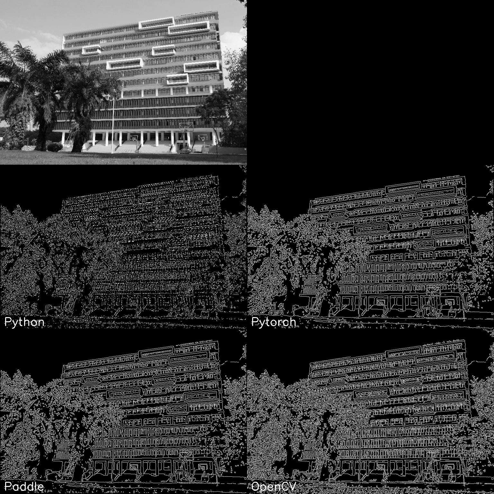

# 简介
* 一个基于 Python 和 cv2 / numpy / scipy / torch / paddle 等模块实现的 Canny 边缘检测器

* 本项目中包含如下三个版本的 Canny 边缘检测器：

    * Python：使用 numpy 模块的原生 python 实现的简易版本 Canny 边缘检测器，效果一般

    * Pytorch：基于 torch 深度学习框架实现的运用矩阵运算并行加速、GPU 计算加速的 Canny 边缘检测器，效果较好

    * Paddle：基于 paddle 深度学习框架实现，功能与结果与 torch 版本保持一致

# 目录结构
* 本项目大致的文件目录结构及功能如下：

    ```bash
    │ requirements.txt # 依赖模块列表
    │
    ├─tools # 脚本工具
    │  │ 
    │  ├─test_all.py # 总体测试脚本
    │  │ 
    │  ├─test_opencv.py # OpenCV 测试脚本
    │  │ 
    │  ├─test_paddle.py # Paddle 测试脚本
    │  │ 
    │  ├─test_python.py # Python 测试脚本
    │  │ 
    │  └─test_pytorch.py # Pytorch 测试脚本
    │  
    ├─cannydet # Canny 边缘检测器代码
    │  │ 
    │  ├─paddle # Paddle 实现
    │  │          
    │  ├─python # Python 实现
    │  │          
    │  └─torch # Pytorch 实现
    │          
    ├─results # 输出结果
    │  │ 
    │  ├─compare # 结果对比图像
    │  │ 
    │  ├─cv2 # OpenCV 输出图像
    │  │ 
    │  ├─paddle # Paddle 输出图像
    │  │          
    │  ├─python # Python 输出图像
    │  │          
    │  └─torch # Pytorch 输出图像
    │      
    └─test_imgs # 测试图像
    ```

# 算法原理
* Canny 是一个经典的图像边缘检测算法，一般包含如下几个步骤：

    * 使用高斯模糊对图像进行模糊降噪处理

    * 基于图像梯度幅值进行图像边缘增强

    * 非极大值抑制处理进行图像边缘细化

    * 图像二值化和边缘连接得到最终的结果

# 结果对比
* 多种实现对比的实测效果图如下：

    

# 性能对比
* 测试平台：

    |CPU|显卡|内存|系统|
    |:-:|:-:|:-:|:-:|
    |AMD Ryzen 5 3600|Nvidia RTX 2060|8G|Windows10|

* 使用上图作为测试图片测试多个实现的耗时长短：

    |实现方式|耗时(s)|
    |:-:|:-:|
    |Python|11.51|
    |Pytorch CPU|0.13|
    |Pytorch GPU|0.04|
    |Paddle CPU|0.40|
    |Paddle GPU|0.06|
    |OpenCV|0.02|

# 快速使用
* 安装依赖

    ```bash
    $ pip install -r requirements.txt
    ```

* 使用下面的命令运行测试脚本：

    ```bash
    # 运行所有实现的测试脚本
    $ python tools/test_all.py

    # 运行 OpenCV 实现的测试脚本
    $ python tools/test_opencv.py

    # 运行 Python 实现的测试脚本
    $ python tools/test_python.py

    # 运行 Pytorch 实现的测试脚本
    $ python tools/test_pytorch.py

    # 运行 Paddle 实现的测试脚本
    $ python tools/test_paddle.py
    ```

* 使用脚本对自定义图片进行边缘检测：

    * Python 实现：

        ```python
        import cv2
        import paddle
        import numpy as np
        from cannydet.paddle import CannyDetector

        lower = 2.5  # 最小阈值
        upper = 5  # 最大阈值

        img_path = 'test_imgs/1-1.jpg'  # 指定测试图像路径
        res_path = 'test.png'  # 指定结果保存路径

        img = cv2.imread(img_path, 1)  # 读取彩色图像
        img = np.transpose(img, [2, 1, 0]) / 255.0 # 转置 + 归一化
        img_tensor = paddle.to_tensor(img[None, ...]).cast('float32') # 转换为 Tensor

        paddle.set_device('cpu') # 设置其运行的设备
        canny = CannyDetector() # 初始化 Canny 检测器

        edge = canny(img_tensor, lower, upper)  # Canny 图像边缘检测
        edge = np.squeeze(edge.numpy()) # 去除 Batch dim
        edge = np.transpose(edge, [1, 0]) # 图像转置
        edge = (edge * 255).astype(np.uint8)  # 反归一化

        cv2.imshow('result', edge)  # 结果预览
        cv2.waitKey(0)  # 等待响应
        cv2.imwrite(res_path, edge)  # 结果保存
        ```

    * Pytorch 实现：

        ```python
        import cv2
        import torch
        import numpy as np
        from cannydet.torch import CannyDetector

        lower = 2.5  # 最小阈值
        upper = 5  # 最大阈值

        img_path = 'test_imgs/1-1.jpg'  # 指定测试图像路径
        res_path = 'test.png'  # 指定结果保存路径

        img = cv2.imread(img_path, 1)  # 读取彩色图像
        img = np.transpose(img, [2, 1, 0]) / 255.0 # 转置 + 归一化
        img_tensor = torch.from_numpy(img[None, ...]).float() # 转换为 Tensor

        canny = CannyDetector(device='cpu') # 初始化 Canny 检测器，可设置其运行的设备

        edge = canny(img_tensor, lower, upper)  # Canny 图像边缘检测
        edge = np.squeeze(edge.cpu().numpy()) # 去除 Batch dim
        edge = np.transpose(edge, [1, 0]) # 图像转置
        edge = (edge * 255).astype(np.uint8)  # 反归一化

        cv2.imshow('result', edge)  # 结果预览
        cv2.waitKey(0)  # 等待响应
        cv2.imwrite(res_path, edge)  # 结果保存
        ```

    * Paddle 实现：

        ```python
        import cv2
        import numpy as np
        from cannydet.python import canny

        lower = 0.1 # 最小阈值
        upper = 0.3 # 最大阈值

        img_path = 'test_imgs/1-1.jpg' # 指定测试图像路径
        res_path = 'test.png' # 指定结果保存路径

        gray = cv2.imread(img_path, 0) # 读取灰度图像
        edge = canny(gray, lower, upper) # Canny 图像边缘检测
        edge = (edge * 255).astype(np.uint8) # 反归一化

        cv2.imshow('result', edge) # 结果预览
        cv2.waitKey(0) # 等待响应
        cv2.imwrite(res_path, edge) # 结果保存
        ```

    * OpenCV 实现：

        ```python
        import cv2

        lower = 30  # 最小阈值
        upper = 70  # 最大阈值

        img_path = 'test_imgs/1-1.jpg'  # 指定测试图像路径
        res_path = 'test.png'  # 指定结果保存路径

        gray = cv2.imread(img_path, 0)  # 读取灰度图像
        edge = cv2.Canny(gray, lower, upper) # Canny 图像边缘检测

        cv2.imshow('result', edge)  # 结果预览
        cv2.waitKey(0)  # 等待响应
        cv2.imwrite(res_path, edge)  # 结果保存
        ```

# 参考资料
* 参考论文：

    ```
    @ARTICLE{4767851,
    author={Canny, John},
    journal={IEEE Transactions on Pattern Analysis and Machine Intelligence}, 
    title={A Computational Approach to Edge Detection}, 
    year={1986},
    volume={PAMI-8},
    number={6},
    pages={679-698},
    doi={10.1109/TPAMI.1986.4767851}}
    ```

* 参考项目：

    * [DCurro/CannyEdgePytorch](https://github.com/DCurro/CannyEdgePytorch)

* 参考文章：

    * [Canny边缘检测 原理&&python代码](https://blog.csdn.net/xiachong27/article/details/88385123)

    * [Canny 边缘检测算法-python实现](https://ai-chen.github.io/%E4%BC%A0%E7%BB%9F%E5%9B%BE%E5%83%8F%E5%A4%84%E7%90%86%E6%96%B9%E6%B3%95/2019/08/21/Canny-%E8%BE%B9%E7%BC%98%E6%A3%80%E6%B5%8B%E7%AE%97%E6%B3%95.html)